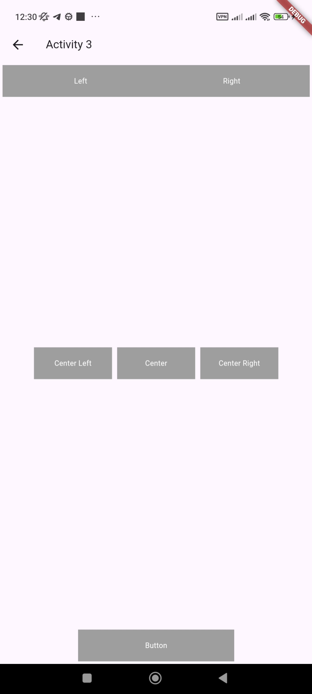

# Лабораторная работа №2. Основы вёрстки

   Цель работы: Изучить основы верстки. Научиться управлять интерфейсом мобильного устройства при разработке программного приложения.

    *Выполнила*: Иволгина Елизавета  
    *Язык*: Dart

## Описание
Приложение состоит из четырёх экранов:

### Первый экран (Activity 1) 
На первом экране пользователь видит заголовок "Activity 1" и четыре кнопки для навигации:

- Activity 2: переходит к экрану 2.
- Activity 3: переходит к экрану 3.
- Activity 4: переходит к экрану 4.
- Exit: закрывает приложение

  


### Второй экран (Activity 2) 
Второй экран содержит набор кнопок, расположенных в сетке. Каждая кнопка не имеет действия по умолчанию, но служит для демонстрации элементов интерфейса.

  
  
### Третий экран (Activity 3) 
На третьем экране кнопки размещены в разных частях экрана. Кнопки также не имеют действий.

  
  
### Четвёртый экран
Четвертый экран содержит одну кнопку, цвет которой меняется при нажатии.
  
  
  
****

## Как работает?
**Первый экран**
(Activity1)   
На первом экране пользователь видит заголовок "Activity 1" и четыре кнопки. Каждая кнопка отвечает за переход на соответствующий экран. При нажатии на кнопку "Activity 2" открывается второй экран, "Activity 3" — третий, "Activity 4" — четвертый, а кнопка "Exit" закрывает приложение. 
```
class Activity1 extends StatelessWidget {
  @override
  Widget build(BuildContext context) {
    return Scaffold(
      appBar: AppBar(title: Text("Activity 1")),
      body: Center(
        child: Column(
          mainAxisAlignment: MainAxisAlignment.spaceAround,
          children: [
            SizedBox(
              width: MediaQuery.of(context).size.width * 0.75,
              height: MediaQuery.of(context).size.height * 0.2,
              child: ElevatedButton(
                onPressed: () => Navigator.pushNamed(context, '/activity2'),
                child: Text('Activity 2'),
              ),
            ),
            // Кнопки для Activity 3 и Activity 4 аналогичны
            SizedBox(
              child: ElevatedButton(
                onPressed: () => Navigator.pushNamed(context, '/activity3'),
                child: Text('Activity 3'),
              ),
            ),
            SizedBox(
              child: ElevatedButton(
                onPressed: () => Navigator.pushNamed(context, '/activity4'),
                child: Text('Activity 4'),
              ),
            ),
            SizedBox(
              child: ElevatedButton(
                onPressed: () => Navigator.of(context).pop(),
                child: Text('Exit'),
              ),
            ),
          ],
        ),
      ),
    );
  }
}
```
- Scaffold: Основная структура экрана с AppBar и содержимым в body.
- ElevatedButton: Кнопки, которые ведут к другим активностям или закрывают приложение.


**Второй экран**
(Activity2) 
На втором экране расположены кнопки, организованные в сетку. Эти кнопки не имеют назначенной функциональности, но демонстрируют различные варианты макета интерфейса. Пользователь может взаимодействовать с кнопками, но они не выполняют никаких действий при нажатии.
```
Widget buildFlatButton(BuildContext context, String label, double widthFactor) {
  return Container(
    width: MediaQuery.of(context).size.width * widthFactor,
    margin: EdgeInsets.all(4),
    child: ClipRect(
      child: Material(
        color: Colors.grey,
        child: InkWell(
          onTap: () {},
          child: Container(
            alignment: Alignment.center,
            height: 50,
            child: Text(label,
              style: TextStyle(color: Colors.white),
            ),
          ),
        ),
      ),
    ),
  );
}
```
Метод  ```buildFlatButton``` создает кнопки с заданной шириной и серым фоном. При нажатии на кнопку не происходит никаких действий, так как onTap пустой.

**Третий экран**
(Activity 3)
Третий экран также состоит из кнопок, размещенных в различных позициях, включая верхние, центральные и нижние области экрана. Это демонстрирует использование виджета  ```Stack```, позволяющий располагать элементы один над другим и управлять их позицией. Все кнопки на этом экране также не имеют функциональности.
```
class Activity3 extends StatelessWidget {
  @override
  Widget build(BuildContext context) {
    return Scaffold(
      appBar: AppBar(title: Text("Activity 3")),
      body: Stack(
        children: [
          Align(alignment: Alignment.topLeft, child: buildFlatButton(context, 'Left', 0.49)),
          Center(child: buildCenterButtons()),
          Align(alignment: Alignment.bottomCenter, child: buildBottomButton()),
        ],
      ),
    );
  }

  Widget buildCenterButtons() {
    return Row(
      mainAxisAlignment: MainAxisAlignment.center,
      children: [
        buildFlatButton(context, 'Center Left', 0.25),
        buildFlatButton(context, 'Center', 0.25),
        buildFlatButton(context, 'Center Right', 0.25),
      ],
    );
  }

  Widget buildBottomButton() {
    return Container(
      width: 440,
      height: 50,
      margin: EdgeInsets.all(4),
      child: ClipRect(
        child: Material(
          color: Colors.grey,
          child: InkWell(
            onTap: () {},
            child: Center(child: Text('Button', style: TextStyle(color: Colors.white))),
          ),
        ),
      ),
    );
  }
}
```

**Четвертый экран**
(Activity 4) 
На четвертом экране находится одна кнопка, которая меняет свой цвет при нажатии. Это позволяет пользователю увидеть изменение состояния в интерфейсе. Кнопка начинается с белого цвета, и при нажатии она становится зеленой.
```
class Activity4 extends StatefulWidget {
  @override
  _Activity4State createState() => _Activity4State();
}
class _Activity4State extends State<Activity4> {
  Color _buttonColor = Colors.white;

  @override
  Widget build(BuildContext context) {
    return Scaffold(
      backgroundColor: Colors.white,
      appBar: AppBar(title: Text("Activity 4")),
      body: Center(
        child: OutlinedButton(
          style: OutlinedButton.styleFrom(
            side: BorderSide(color: Color(0xFF505050), width: 2),
            shape: RoundedRectangleBorder(borderRadius: BorderRadius.circular(24)),
            backgroundColor: _buttonColor,
          ),
          onPressed: () {
            setState(() {
              _buttonColor = Colors.lightGreen;
            });
          },
          child: Text('New Button'),
        ),
      ),
    )
```
Здесь используется метод 
setState`, чтобы обновить цвет кнопки при нажатии, что позволяет динамически изменять состояние интерфейса.
Толщина обводки соответствует месяцу рождения - февралю.

 **Как собрать**   
* Установите Flutter SDK.
* Настройте Android studio: Установите плагины Flutter и Dart.
1. Загрузите репозиторий
2. Запустите Android Studio
3. Нажмите на "Open" и выберите папку с проектом
4. Выберите эмулятор(или подключите реальное устройство)
5. Нажмите "Run"
****
# laba_2

